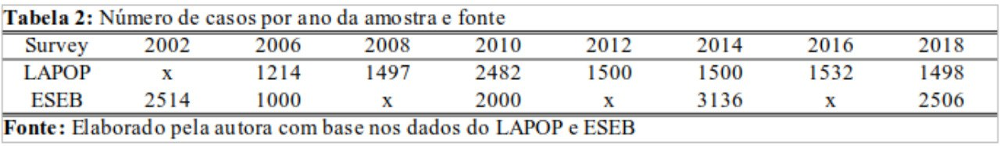

```{r setup, include=FALSE}

options(htmltools.dir.version = FALSE)

knitr::opts_chunk$set(
  echo = FALSE,
  fig.align = "center",
  message = FALSE,
  warning = FALSE,
  cache = TRUE
)

library(tidyverse)
library(ggthemes)
library(plotly)
library(patchwork)

load("~/ABCP_2022/lapop_abcp.RData")
load("~/ABCP_2022/eseb_long_presidente.Rda")
load("~/ABCP_2022/ideologia_2002_2020.Rda")

```

--

### Introdução
--

O trabalho se refere ao *gap* de gênero nas atitudes políticas no Brasil no período entre 2002 e 2018.
--

### Problema de pesquisa
--

Um conjunto distinto de padrões de socialização experimentados por homens e mulheres podem influenciar de forma diferenciada os valores centrais, as orientações políticas e o comportamento (Biroli, 2016). Além disso, a estrutura tradicional de organização social e familiar imputam às mulheres diferentes relações e funções sociais, nessa diferenciação de papéis, o gênero, seria então, um fator importante para a condução de comportamentos e atitudes políticas. 

--

### Principal pergunta de pesquisa
--

Diante disto, um fator individual como o gênero, teria relação com as atitudes políticas e voto no Brasil? Se sim, em quais dimensões?
--
---

### Objetivo principal
--

Explorar as atitudes políticas e comportamentos eleitorais referentes ao grupo do sexo feminino em comparação com o sexo masculino entre 2002 e 2018.

---
### Arcabouço teórico

--

*Gender gap* no contexto internacional 

- *Voting gap* -  diferença de gênero na escolha de um representante/partido
    - Mulheres se identificam mais com os Democratas enquanto os homens com o Republicanos e são mais pronpensas a votar no candidato à reeleição (Manza; Brooks, 1998; Lizotte; Sidman, 2019)
    
- *Ideological gap* - diferenças em posicionamentos ideológicos 
    - Diferença ideológica tradicional e diferença ideológica moderna (Inglehart; Norris, 2000)
    
- *Policy gap* - diferença nas preferências por políticas públicas 
     - Mulheres demandam por um conjunto de políticas públicas diferentes daquelas reivindicadas por homens (Diekman; Schneider, 2010).
     
---

### Desenho de pesquisa

**Variável independente**

   - Gênero

**Variáveis dependentes** - issues / atitudes políticas

  - Voto
  - Conservadorismo
  - Ideologia
  - Interesse por política
  - Partidarismo

---
## Metodologia
--

Foi utilizado metodologia quantitativa de cunho exploratório que combina variáveis atitudinais e de nível indivídual para analisar as disparidades ou semelhanças entre os eleitores de acordo com o gênero entre 2002 a 2018. 

Os dados são derivados do Projeto de Opinião Pública na América Latina (LAPOP) e do Estudo Eleitoral Brasileiro (ESEB).

 - Manipulação dos bancos de dados.

```{r out.height = "200px", out.width='850px', echo=F, fig.align='left'}

```

---
class: title-slide-custom, center

<br><br><br><br><br><br><br><br><br>

# Resultados

---

```{r echo = FALSE, warning=FALSE, message = FALSE, fig.height= 13, fig.width= 16, fig.align='center'}

eseb_long_presidente %>% 
  filter(presidente_1 != "NA") %>% 
  ggplot(aes(x=ano, y=p_voto_sexo, col = as_factor(presidente_1), fill = sexo, linetype = sexo))+
  geom_line(stat = "identity", size = 2)+
  geom_errorbar(aes(ymin = p_voto_sexo - erro, ymax = p_voto_sexo + erro, col = presidente_1),
                position = position_dodge(0.02), size = 1.2, width = 1)+
  scale_x_continuous(breaks = c(2002, 2006, 2010, 2014, 2018))+
  scale_y_continuous(labels=function(x) paste0(x,"%"))+
  scale_color_manual(values = c("#cc0000", "#008ae6"))+
  ggthemes::theme_fivethirtyeight()+
  labs(fill = "",
       y = "Votos válidos", 
       linetype = "", 
       col = "", 
       title = "Voto para presidente e gênero 2002 - 2018", 
       caption = "Elaborado pelos autores com base nos dados do ESEB 2002-2018\nLinhas verticais indicam as margens de erro das estimativas")+
  theme(title = element_text(size = 22),
        axis.title.y = element_text(size = 23),
        axis.text.y = element_text(size = 23),
        axis.text.x = element_text(size = 23),
        legend.text = element_text(size = 23),
        plot.caption = element_text(hjust = 0,size = 20),
        panel.background = element_rect(fill = "white", colour = "white", color = "white"),
        plot.background = element_rect(fill = "white", colour = "white", color = "white"),
        legend.background=element_rect(fill="white"),
        panel.grid.major.x = element_line(colour = "#cccccc", size = 0.8),
        panel.grid.major.y = element_line(colour = "#cccccc", size = 0.8),
        legend.spacing.x = unit(1.0, "cm"),
        legend.key.width = unit(2, "cm"),
        legend.box = "horizontal",
        legend.key = element_rect(fill = "white", color = "white"),
        strip.background=element_rect(fill="white", colour="white"))
```

---
class: title-slide-custom, center

<br><br><br><br><br><br><br><br><br>

# Democracia como melhor forma de governo e apoio à democracia 

---

```{r echo = FALSE, warning=FALSE, message = FALSE, fig.height= 16, fig.width= 18, fig.align='center'}
# Democracia
long_ing4 <- lapop_abcp %>%
  filter(ing4 != "NA", ing4 != 988888, ing4 != 888888) %>% 
  group_by(Mulher, Ano) %>% 
  summarise(media = mean(ing4),
            n = n(),
            s2 = var(ing4),
            sd = (1.96*sqrt(s2/(n-1))),
            inferior = media - (1.96*sqrt(s2/(n-1))),
            superior = media + (1.96*sqrt(s2/(n-1))))

a <- long_ing4 %>% 
  mutate(Mulher = case_when(Mulher == 0 ~ "Homem", 
                            Mulher == 1 ~ "Mulher")) %>% 
  ggplot(aes(x = Ano, y = media, col = as_factor(Mulher), group = as_factor(Mulher)))+
  geom_line(stat = "identity", size = 1.2)+
  geom_errorbar(aes(x = as_factor(Ano), ymin = media-sd, ymax = media + sd),
                position = position_dodge(0.02), width = .3, size = 1)+
  ylim(0,7)+
  labs(fill = "",
       col = NULL,
       y = "Resposta média",
       title = "Democracia como melhor forma de governo e Gênero", 
       caption = "Elaborado pelos autores com base no LAPOP 2006-2018")+
  scale_color_manual(values = c("#00ace6", "#005580"))+
  theme_fivethirtyeight()+
  theme(title = element_text(size = 14),
        axis.title.y = element_text(size = 15),
        axis.text.y = element_text(size = 15),
        axis.text.x = element_text(size = 15),
        legend.text = element_text(size = 16),
        plot.caption = element_text(hjust = 0,size = 13),
        panel.background = element_rect(fill = "white", colour = "white", color = "white"),
        plot.background = element_rect(fill = "white", colour = "white", color = "white"),
        legend.background=element_rect(fill="white"),
        panel.grid.major.x = element_line(colour = "#cccccc", size = 0.8),
        panel.grid.major.y = element_line(colour = "#cccccc", size = 0.8),
        legend.box = "horizontal",
        legend.key = element_rect(fill = "white", color = "white"),
        strip.background=element_rect(fill="white", colour="white"))


pn4_lapop <- lapop_abcp %>%
  filter(pn4 %in% c("1","2","3","4"))%>%
  mutate(Mulher = case_when(Mulher == 0 ~ "Homem",
                            Mulher == 1 ~ "Mulher"),
         pn4 = case_when(pn4 == 1 ~ "Satisfeito",
                         pn4 == 2 ~ "Satisfeito",
                         pn4 == 3 ~ "Insatisfeito",
                         pn4 == 4 ~ "Insatisfeito")) %>%
  group_by(Ano, Mulher, pn4) %>%
  summarise(n_pn4 = n()) %>%
  mutate(perc = n_pn4/sum(n_pn4)*100,
         soma = sum(n_pn4))

pn4_lapop_wide <- pn4_lapop %>%
  select(1,2,3,4,5) %>%
  pivot_wider(names_from = pn4, values_from = c(perc, n_pn4)) %>% 
  mutate(p = perc_Satisfeito/100,
         erro = sqrt((p*(1 - p)/n_pn4_Satisfeito)),
         p_erro = erro * 100)


b <- ggplot(pn4_lapop_wide)+
  aes(x = as_factor(Ano))+
  geom_line(aes(y = perc_Satisfeito,  group = Mulher, col = Mulher), stat = "identity", size = 1.5)+
  geom_point(aes(y = perc_Satisfeito,  group = Mulher, col = Mulher), size = 3, stat = "identity", size = 1.5)+
  geom_errorbar(aes(ymin = perc_Satisfeito - p_erro, ymax = perc_Satisfeito + p_erro, col = Mulher), 
                position =  position_dodge(0.05), size = 1, width = 0.5)+
  scale_colour_manual(values = c("#00ace6", "#005580"))+
  ylim(0, 85)+  
  scale_y_continuous(labels=function(x) paste0(x,"%"))+
  labs(col = "",
       y = "Satisfação",
       caption = "Elaborado pelos autores com base no LAPOP 2006-2018", 
       title = "Percentual de Satisfação com a Democracia e Gênero")+
  theme_fivethirtyeight()+
  theme(title = element_text(size = 14),
        axis.title.y = element_text(size = 15),
        axis.text.y = element_text(size = 15),
        axis.text.x = element_text(size = 15),
        legend.text = element_text(size = 16),
        plot.caption = element_text(hjust = 0,size = 13),
        panel.background = element_rect(fill = "white", colour = "white", color = "white"),
        plot.background = element_rect(fill = "white", colour = "white", color = "white"),
        legend.background=element_rect(fill="white"),
        panel.grid.major.x = element_line(colour = "#cccccc", size = 0.8),
        panel.grid.major.y = element_line(colour = "#cccccc", size = 0.8), 
        legend.box = "horizontal",
        legend.key = element_rect(fill = "white", color = "white"),
        strip.background=element_rect(fill="white", colour="white"))

a / b


```

---
class: title-slide-custom, center

<br><br><br><br><br><br><br><br><br>

# Conservadorismo

---

```{r echo = FALSE, warning=FALSE, message = FALSE, fig.height= 20, fig.width= 23, fig.align='center'}
# CONSERVADORISMO

vb50_lapop <- lapop_abcp %>%
  filter(vb50 %in% c("1","2","3","4"))%>%
  mutate(Mulher = case_when(Mulher == 0 ~ "Homem",
                            Mulher == 1 ~ "Mulher"),
         vb50 = case_when(vb50 == 1 ~ "Concorda",
                          vb50 == 2 ~ "Concorda",
                          vb50 == 3 ~ "Discorda",
                          vb50 == 4 ~ "Discorda")) %>%
  group_by(Ano, Mulher, vb50) %>%
  summarise(n_vb50 = n()) %>%
  mutate(perc = n_vb50/sum(n_vb50)*100,
         soma = sum(n_vb50))


vb50_lapop_wide <- vb50_lapop %>%
  select(1,2,3,4,5) %>%
  pivot_wider(names_from = vb50, values_from = c(perc, n_vb50)) %>% 
  mutate(p = perc_Concorda/100,
    erro = sqrt((p *(1 - p)/n_vb50_Concorda)),
    p_erro = erro * 100)

plot_vb50 <- ggplot(vb50_lapop_wide)+
  aes(x = as_factor(Ano), y = perc_Concorda, col = as_factor(Mulher), group = as_factor(Mulher))+
  geom_line(stat = "identity", size = 1.8)+
  geom_errorbar(aes(x = as_factor(Ano), ymin = perc_Concorda - p_erro, ymax = perc_Concorda + p_erro),
                 position = position_dodge(0.05), size = 1.7, width = .5)+
  scale_y_continuous(labels=function(x) paste0(x,"%"), limits = c(0,85), breaks = c(0,10,20,30,40,50,60, 70, 80))+
  labs(
        y = "Concordam com a frase",
        title = "Homens são melhores líderes políticos do que mulheres")+
  scale_color_manual(values = c("#00ace6", "#005580"))+
  theme_fivethirtyeight()+
 theme(title = element_text(size = 18),
        axis.title.y = element_text(size = 20),
        axis.text.y = element_text(size = 20),
        axis.text.x = element_text(size = 20),
        legend.text = element_text(size = 20),
        plot.caption = element_text(hjust = 0,size = 18),
        panel.background = element_rect(fill = "white", colour = "white", color = "white"),
        plot.background = element_rect(fill = "white", colour = "white", color = "white"),
        legend.background=element_rect(fill="white"),
        legend.position = "bottom",
        legend.key = element_rect(fill = "white", color = "white"),
        strip.background=element_rect(fill="white", colour="white"))

aborto_genero <- lapop_abcp %>% 
  filter(aborto != 988888, aborto != 888888) %>%
  group_by(Ano, Mulher, aborto) %>% 
  summarise(n_aborto = n()) %>% 
  group_by(Ano, Mulher) %>% 
  mutate(n = sum(n_aborto,  na.rm = T),
         p = n_aborto/n, 
         erro = sqrt((p *(1 - p)/n)),
         perc = p *100,
         p_erro = erro * 100)

plot_aborto <- aborto_genero %>% 
  filter(aborto != 988888, aborto != 888888, aborto == 1) %>%
  mutate(Mulher = case_when(Mulher == 0 ~ "Homem", 
                            Mulher == 1 ~ "Mulher")) %>%
  ggplot(aes(x = as.numeric(Ano), y = perc, col = Mulher))+
  geom_line(stat = "identity", size = 1.8)+
  #geom_point(size = 4)+
  geom_errorbar(aes( ymin = perc - p_erro, ymax = perc + p_erro), 
                 position = position_dodge(0.05), size = 1.7, width = .5)+
  scale_x_continuous(breaks = c( 2012, 2014, 2016, 2018))+
  scale_y_continuous(labels=function(x) paste0(x,"%"), limits = c(0,85), breaks = c(0,10,20,30,40,50,60, 70,80))+
  labs(x = "",
       y = "", 
       caption = "",
       title = "Aborto se justifica quando a saúde da mãe esta em perigo")+
  scale_color_manual(values = c("#00ace6", "#005580"))+
  theme_fivethirtyeight()+
  theme(title = element_text(size = 18),
        axis.title.y = element_text(size = 20),
        axis.text.y = element_text(size = 20),
        axis.text.x = element_text(size = 20),
        legend.text = element_text(size = 20),
        plot.caption = element_text(hjust = 0,size = 18),
        panel.background = element_rect(fill = "white", colour = "white", color = "white"),
        plot.background = element_rect(fill = "white", colour = "white", color = "white"),
        legend.background=element_rect(fill="white"),
        legend.position = "bottom",
        legend.key = element_rect(fill = "white", color = "white"),
        strip.background=element_rect(fill="white", colour="white"))


long_d6 <- lapop_abcp %>%
  filter(d6 != "NA", d6 != 988888, d6 != 888888) %>% 
  group_by(Mulher, Ano) %>% 
  summarise(media = mean(d6),
            n = n(),
            s2 = var(d6),
            sd = (1.96*sqrt(s2/(n-1))),
            inferior = media - (1.96*sqrt(s2/(n-1))),
            superior = media + (1.96*sqrt(s2/(n-1))))

plotd6 <- long_d6 %>% 
   mutate(Mulher = case_when(Mulher == 0 ~ "Homem", 
                             Mulher == 1 ~ "Mulher")) %>% 
  ggplot(aes(x = as_factor(Ano), y = media, col = as_factor(Mulher), group = as_factor(Mulher)))+
  geom_line(stat = "identity", size = 1.8)+
  geom_errorbar(aes(x = as_factor(Ano), ymin = media-sd, ymax = media + sd),
                 position = position_dodge(.1), width = .8, size = 1.7)+
  ylim(0,7.5)+
  labs(fill = "",
       col = NULL,
       y = "",
       caption = "Elaborado pelos autores com base no LAPOP 2006-2018",
       title = "Direito de Homossexuais se casarem")+
  
 scale_color_manual(values = c("#00ace6", "#005580"))+
  theme_fivethirtyeight()+
  theme(title = element_text(size = 18),
        axis.title.y = element_text(size = 20),
        axis.text.y = element_text(size = 20),
        axis.text.x = element_text(size = 20),
        legend.text = element_text(size = 20),
        plot.caption = element_text(hjust = 0,size = 18),
        panel.background = element_rect(fill = "white", colour = "white", color = "white"),
        plot.background = element_rect(fill = "white", colour = "white", color = "white"),
        legend.background=element_rect(fill="white"),
        legend.position = "bottom",
        legend.key = element_rect(fill = "white", color = "white"),
        strip.background=element_rect(fill="white", colour="white"))


long_d5 <- lapop_abcp %>%
  filter(d5 != "NA", d5 != 988888, d5 != 888888) %>% 
  group_by(Mulher, Ano) %>% 
  summarise(media = mean(d5),
            n = n(),
            s2 = var(d5),
            sd = (1.96*sqrt(s2/(n-1))),
            inferior = media - (1.96*sqrt(s2/(n-1))),
            superior = media + (1.96*sqrt(s2/(n-1))))

plotd5 <- long_d5 %>% 
  mutate(Mulher = case_when(Mulher == 0 ~ "Homem", 
                            Mulher == 1 ~ "Mulher")) %>% 
  ggplot(aes( x = as_factor(Ano), y = media, col = as_factor(Mulher), group = as_factor(Mulher)))+
  geom_line(stat = "identity", size = 2)+
  geom_errorbar(aes(x = as_factor(Ano), ymin = media-sd, ymax = media + sd),
                position = position_dodge(.1), width = .8, size = 1.7)+
  ylim(0,7.5)+
  labs(fill = "",
       col = NULL,
       y = "Média",
       caption = "",
       title = "Direito de Homossexuais ocuparem cargos públicos")+
  scale_color_manual(values = c("#00ace6", "#005580"))+
  theme_fivethirtyeight()+
  theme(title = element_text(size = 18),
        axis.title.y = element_text(size = 20),
        axis.text.y = element_text(size = 20),
        axis.text.x = element_text(size = 20),
        legend.text = element_text(size = 20),
        plot.caption = element_text(hjust = 0,size = 18),
        panel.background = element_rect(fill = "white", colour = "white", color = "white"),
        plot.background = element_rect(fill = "white", colour = "white", color = "white"),
        legend.background=element_rect(fill="white"),
        legend.position = "bottom",
        legend.key = element_rect(fill = "white", color = "white"),
        strip.background=element_rect(fill="white", colour="white"))

(plot_vb50 + plot_aborto) / (plotd5 + plotd6)


```

---
class: title-slide-custom, center

<br><br><br><br><br><br><br><br><br>

# Interesse por política

---
```{r echo = FALSE, warning=FALSE, message = FALSE, fig.height= 8, fig.width= 12, fig.align='center'}
#INTERESSE POR POLÍTICA

long_interesse <- lapop_abcp %>%
  filter(interesse <= 4) %>% 
  group_by(Mulher, Ano, interesse) %>% 
  summarise(n_interesse = n()) %>% 
  group_by(Mulher, Ano) %>% 
  mutate(n = sum(n_interesse, na.rm = T), 
         p = n_interesse/n, 
         erro = sqrt((p *(1 - p)/n)),
         perc = p *100,
         p_erro = erro * 100)


a <- long_interesse %>% 
  mutate(Mulher = case_when(Mulher == 0 ~ "Homem", 
                            Mulher == 1 ~ "Mulher"), 
         interesse = case_when(interesse == 1 ~ "Muito", 
                               interesse == 2 ~ "Algo",
                               interesse == 3 ~ "Pouco",
                               interesse == 4 ~ "Nada"),
         extremo = if_else(interesse %in% c("Muito", "Nada"), 1, 0)) %>% 
  
  ggplot(aes(x = as.numeric(Ano), y = perc, col = as_factor(interesse), fill = Mulher, linetype = Mulher))+
  geom_line(stat = "identity", size = 1)+
  geom_errorbar(aes(ymin = perc - p_erro, ymax = perc + p_erro), 
                position =  position_dodge(0.05), size = 1, width = 1.5)+
  scale_x_continuous(breaks = c(2006, 2008, 2010, 2012, 2014, 2016, 2018))+
  theme_fivethirtyeight()+
  #facet_grid(extremo~.)+
  labs(title = "Interesse por política e Gênero",
       fill = "", 
       col = "", 
       y = "", 
       linetype = "", 
       caption = "Elaborado pelos autores com base no LAPOP 2006-2018")+
  scale_color_manual(values = c("#0640bc", "#bd99cc",  "#8caef9" ,"#734488" ))+
  scale_y_continuous(labels=function(x) paste0(x,"%"))+
  theme(title = element_text(size = 10),
  axis.title.y = element_text(size = 8),
  axis.text.y = element_text(size = 8),
  axis.text.x = element_text(size = 8),
  legend.text = element_text(size = 8),
  plot.caption = element_text(hjust = 0,size = 8),
  panel.background = element_rect(fill = "white", colour = "white", color = "white"),
  plot.background = element_rect(fill = "white", colour = "white", color = "white"),
  legend.background=element_rect(fill="white"),
  legend.position = "bottom",
  legend.key = element_rect(fill = "white", color = "white"),
  strip.background=element_rect(fill="white", colour="white"))

m = list(
  l = 100,
  r = 40,
  b = 100,
  t = 50,
  pad = 0, x=-1, y= -2,  xanchor='left', yanchor='bottom',   orientation='h')

  ggplotly(a) %>% 
    layout(autosize = F, width = 800, height = 600, margin = m, 
          annotations = 
            list(x = 10, y = 5,
              text = "Elaborado pelos autores com base no LAPOP 2006-2018"))

```


---
class: title-slide-custom, center

<br><br><br><br><br><br><br><br><br>

# Ideologia

---
```{r echo = FALSE, warning=FALSE, message = FALSE, fig.height= 12, fig.width= 14, fig.align='center'}

# IDEOLOGIA

ideologia_2002_2020 %>% 
  mutate(Mulher = if_else(Mulher == 0, "Homem", "Mulher")) %>% 
  ggplot()+
  aes(x = Ano, y = media_ideologia, group = as_factor(Mulher), col = as_factor(Mulher))+
  geom_line(stat = "identity", size = 1.3)+
  geom_errorbar(aes(x=Ano, ymin = min, ymax = max),
                position = position_dodge(0.00), width = .3, size = 1.2)+
  geom_hline(yintercept = 5.5, color="grey50",linetype=3)+
  annotate("text",x= 0.4, y=5.4,
           label = "Centro",fontface="bold",
           size=6.5,family="Times New Roman",hjust=0)+
  geom_hline(yintercept = 7, color="grey50",linetype=3)+
  
  # Presidente Lula
  
  annotate("rect",xmin=0.5,xmax="2010",
           ymin = 7, ymax = 7.5, alpha = 0.3) +
  geom_vline(xintercept = "2010", color="grey50",linetype=3)+
  annotate("text",x=2.4, y= 7.1, 
           label = " Lula",
           size=9,family="Times New Roman",hjust=0,vjust=0) +
  
  # Presidenta Dilma
  
  annotate("rect",xmin=3.1, xmax="2016",
           ymin = 7, ymax = 7.5, alpha = 0.2) +
  geom_vline(xintercept = "2016", color="grey50",linetype=3)+
  annotate("text",x=5.9, y=4.5, 
           label = "Impeachment",#fontface="bold",
           size=6.5,family="Times New Roman",angle=90,hjust=1,vjust=0) +
  annotate("text",x=5.2, y= 7.1, 
           label = " Dilma",
           size=9,family="Times New Roman",hjust=0,vjust=0) +
  
  # Presidente Temer
  
  annotate("rect",xmin= 6.1, xmax="2018",
           ymin = 7, ymax = 7.5, alpha = 0.1) +
  annotate("text",x=6, y= 7.1, 
           label = " Temer",
           size=9,family="Times New Roman",hjust=0,vjust=0) +
  
  # Presidente Bolsonaro
  
  annotate("rect",xmin= 7., xmax="2020",
           ymin = 7, ymax = 7.5, alpha = 0.4) +
  geom_vline(xintercept = "2018", color="grey50",linetype=3)+
  annotate("text",x=7, y= 7.1, 
           label = " Bolsonaro",
           size=9,family="Times New Roman",hjust=0,vjust=0) +
  
  scale_color_manual(values = c( "#00ace6","#005580"))+
  labs(col = "", 
       x="", 
       y="Média (escala de 1 a 10)")+

  ylim(4.1,7.5)+

  ggthemes::theme_fivethirtyeight()+
  theme(title = element_text(size = 12),
        axis.title.y = element_text(size = 24, family = "Times New Roman"),
        axis.text.y = element_text(size = 24, family = "Times New Roman" ),
        axis.text.x = element_text(size = 24, family = "Times New Roman" ),
        legend.text = element_text(size = 25, family = "Times New Roman" ),
        plot.caption = element_text(hjust = 0, size = 19, family = "Times New Roman"),
        panel.background = element_rect(fill = "white", colour = "white", color = "white"),
        plot.background = element_rect(fill = "white", colour = "white", color = "white"),
        legend.background=element_rect(fill="white"),
        legend.key = element_rect(fill = "white", color = "white"),
        strip.background=element_rect(fill="white", colour="white"), 
        panel.grid.major.x = element_line(colour = "#eceff2", size = 0.2),
        panel.grid.major.y = element_line(colour = "#eceff2", size = 0.2))

```

---
class: title-slide-custom, center

<br><br><br><br><br><br><br><br><br>

# Simpatia Partidária

---

```{r echo = FALSE, warning=FALSE, message = FALSE, fig.height= 12, fig.width= 14, fig.align='center'}
 
simpatia_part_genero <- lapop_abcp %>% 
  filter(vb10 != 988888, vb10 != 888888) %>%
  group_by(Ano, Mulher, vb10) %>% 
  summarise(n_simpatia = n()) %>% 
  group_by(Ano, Mulher) %>% 
  mutate(n = sum(n_simpatia,  na.rm = T),
         p = n_simpatia/n, 
         erro = sqrt((p *(1 - p)/n)),
         perc = p *100,
         p_erro = erro * 100)


simpatia_part_genero %>% 
  filter(vb10 == 1) %>% 
   mutate(Mulher = case_when(Mulher == 0 ~ "Homem", 
                            Mulher == 1 ~ "Mulher"),
         vb10 = case_when(vb10 == 1 ~ "Sim",
                          vb10 == 2 ~ "Não")) %>%
  ggplot(aes(x = as.numeric(Ano), y = perc, col = Mulher))+
  geom_line(stat = "identity", size = 2)+
  geom_point(size =4)+
  geom_errorbar(aes(ymin = perc - p_erro, ymax = perc + p_erro), 
                 position =  position_dodge(0.05), size = 1, width = 0.5)+
  scale_x_continuous(breaks = c(2006, 2008, 2010, 2012, 2014, 2016, 2018))+
  ylim(0,50)+
  scale_y_continuous(labels=function(x) paste0(x,"%"))+
  labs(x = "",
       caption = "Elaborado pelos autores com base no LAPOP 2006-2018",
       y = "", 
       col = NULL, 
       title = "Simpatia partidária e gênero")+
  scale_color_manual(values = c("#00ace6", "#005580"))+
  theme_fivethirtyeight()+
   theme(title = element_text(size = 13),
        axis.title.y = element_text(size = 18),
        axis.text.y = element_text(size = 18),
        axis.text.x = element_text(size = 18),
        legend.text = element_text(size = 18),
        plot.caption = element_text(hjust = 0,size = 18),
        panel.background = element_rect(fill = "white", colour = "white", color = "white"),
        plot.background = element_rect(fill = "white", colour = "white", color = "white"),
        legend.background=element_rect(fill="white"),
        legend.position = "bottom",
        legend.key = element_rect(fill = "white", color = "white"),
        strip.background=element_rect(fill="white", colour="white"))

```

---

### Considerações finais

Por meio das análises bivariadas, pode-se considerar que existe uma relação entre a variável gênero e as atitudes, ou seja, o gênero faz diferença no conjunto de *issues*. 

Essas diferenças geralmente não são consistentes durante toda a análise temporal. 

**As relações entre gênero e atitudes que se mostraram diferentes:**

 -- Mulheres expressam mais concordância com o casamento de homossexuais e o direito desses ocuparem cargos públicos;
 
 -- Mulheres tendem a concordar menos que um homem seja melhor liderança política;
 
 -- Mulheres tendem a expressar menos indetificação partidária do que os homens;
 
 -- Mulheres manifestam menos interesse por política.


---

**As semelhanças:**

Não relação entre gênero e atitudes 

 -- Democracia como melhor forma de governo
 
 -- Confiança nas instituições (com exceção das forças armadas e igrejas)
 
 -- Ideologia (exceto em 2018)


### Próximos passos

 -- Calcular não apenas estimativas intervalares como os Intervalos de Confiança, como também calcular testes de diferenças de médias ou de proporção entre os dois grupos;
 
 -- Analisar as diferenças intragrupo: mulheres em diferentes idades, classes sociais, inserção no mercado de trabalho, religião.

---

### Referências

BIROLI, F. Divisão Sexual do Trabalho e Democracia. Dados, v. 59, n. 3, p. 719–754, 2016.

DIEKMAN, A. B.; SCHNEIDER, M. C. A social role theory perspective on gender gaps in political attitudes. Psychology of Women Quarterly, v. 34, n. 4, p. 486–497, 2010.

INGLEHART, R.; NORRIS, P. The developmental theory of the gender gap: Women’s and men’s voting behavior in global perspective. International Political Science Review, v. 21, n. 4, p. 441–463, 2000.

LIZOTTE, M. K. Gender Differences in Public Opinion: Values and Political
Consequences. [s.l.] Temple University Press, 2021.

MANZA, J.; BROOKS, C. The Gender Gap in U.S. Presidential Elections: When? Why? Implications? American Journal of Sociology, v. 103, n. 5, p. 1235–1266, 1998.


 